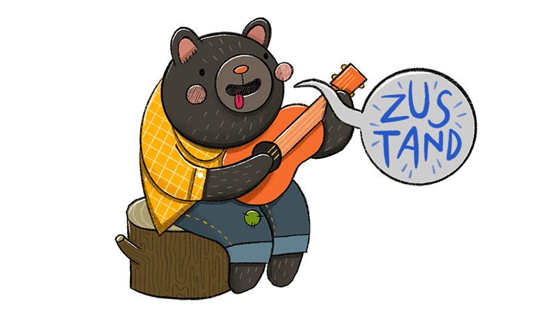
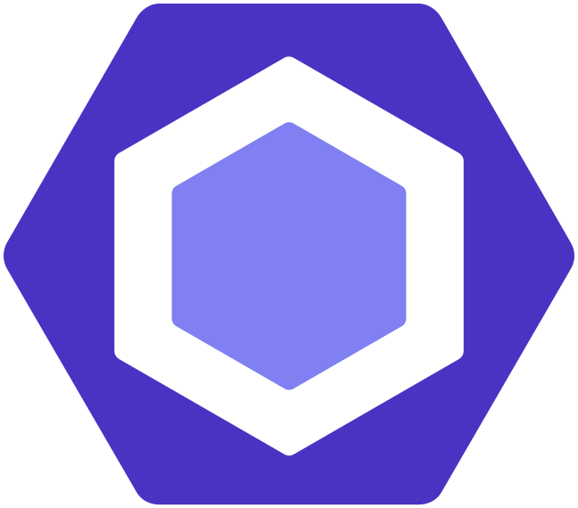
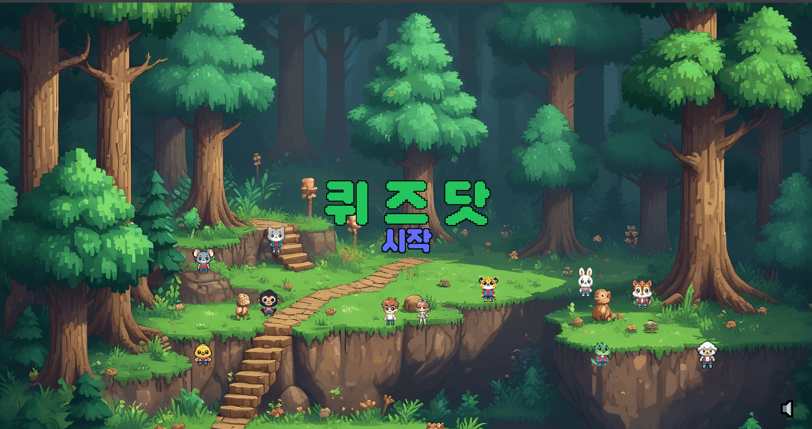
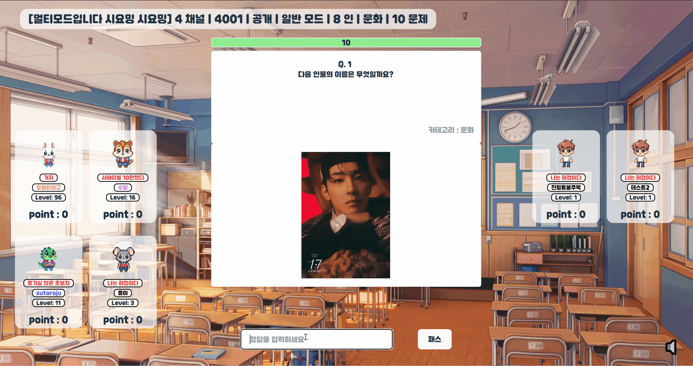
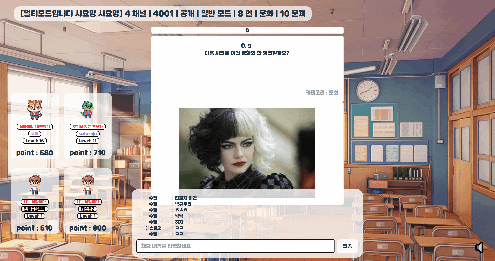
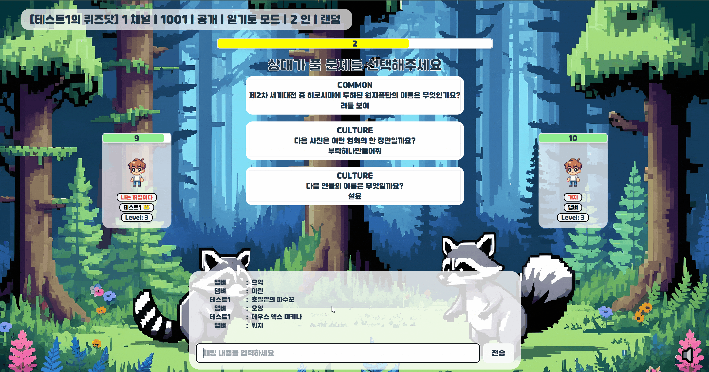
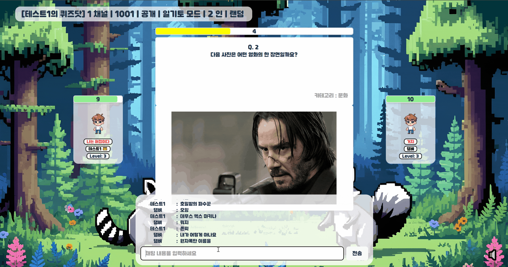

<div align="center">
  <br />
  
  <br />
  <h2>다양한 상식을 재밌게 익힐 수 있는 퀴즈 게임 서비스</h2>
<h3>삼성 청년 소프트웨어 아카데미 자율 프로젝트 </h3>
  <a href="https://10d211.p.ssafy.io/">
   
  </a>
  <a href="https://www.figma.com/design/6RUZRL3CBLDXE10Ioum1Cw/%EC%9E%90%EC%9C%A8-%ED%94%84%EB%A1%9C%EC%A0%9D%ED%8A%B8?node-id=0%3A1&t=ZDyFrRXHB0Eb99M1-1">
   
  </a>
  <a href="http://k10d102.p.ssafy.io/api/swagger-ui/index.html#/">
   
  </a>

<b>[ SSAFY 자율 PJT ] TEAM 막내온탑</b>

<br />

</div>

## 목차

1. [**웹 서비스 소개**](#1)
1. [**기술 스택**](#2)
1. [**주요 기능**](#3)
1. [**프로젝트 구성도**](#4)
1. [**서비스 화면**](#5)
1. [**개발 팀 소개**](#6)
1. [**개발 기간 및 일정**](#7)
1. [**디렉터리 구조**](#8)
1. [**산출물**](#9)

 <!-- 1. [**실행 방법**](#8) -->

<br />

<div id="1"></div>

## ✨ 웹 서비스 소개

야, 니가 그렇게 퀴즈를 잘해 :question: 퀴즈닷으로 따라와 :angry: <br>
QUIZDOT은 퀴즈를 다양한 게임 모드를 통해 풀어볼 수 있는 웹 어플리케이션입니다. <br>
QUIZDOT을 통해 사용자들은 다양한 분야의 상식을 조금 더 재밌게 키워볼 수 있습니다. <br>

### [QuizDot 바로 가기](https://k10d102.p.ssafy.io/)

<br/>

<div id="2"></div>

## 🛠️ 기술 스택

### Frontend

<table>
  <tr align='center'>
    <td width="80px" height="60px">
      <a href="https://www.tcpschool.com/html/html5_intro_intro" target="_blank"></a>
    </td>
    <td width="80px" height="60px">
      <a href="https://www.w3schools.com/css/" target="_blank"></a>
    </td>
    <td width="80px" height="60px">
      <a href="https://reactjs.org/" target="_blank"></a>  
    </td>
    <td width="80px" height="60px">
      <a href="https://www.typescriptlang.org/" target="_blank"></a>  
    </td>
    <td width="80px" height="60px">
      <a href="https://www.tailwindcss.com/" target="_blank"></a>
    </td>
  </tr>
  <tr align='center'>
    <td>HTML5</td>
    <td>CSS3</td>
    <td>React</td>
    <td>Typescript</td>
    <td>Tailwind<br/> CSS</td>
  </tr>
</table>

<table>
  <tr align='center'>
    <td width="80px" height="60px">
      <a href="https://tanstack.com/query/latest/docs/framework/react/overview" target="_blank"></a>
    </td>
    <td width="80px" height="60px">
      <a href="https://zustand-demo.pmnd.rs/" target="_blank"></a>
    </td>
    <td width="80px" height="60px">
      <a href="https://eslint.org/" target="_blank"></a>
    </td>
    <td width="80px" height="60px">
      <a href="https://stomp-js.github.io/" target="_blank"></a> 
    </td>
    <td width="80px" height="60px">
      <a href="https://axios-http.com/kr/docs/intro" target="_blank"></a>
    </td>
  </tr>
  <tr align='center'>
    <td>React<br/>Query</td>
    <td>Zustand</td>
    <td>Eslint</td>
    <td>Stomp js</td>
    <td>Axios</td>
  </tr>
</table>

<table>
  <tr align='center'>
    <td width="80px" height="60px">
      <a href="https://prettier.io/" target="_blank"></a>
    </td>
    <td width="80px" height="60px">
      <a href="https://vitejs.dev/" target="_blank"></a>
    </td>
  </tr>
  <tr align='center'>
    <td>Prettier</td>
    <td>Vite</td>
  </tr>
</table>

<br/>

### Backend

<table>
  <tr align='center'>
    <td width="80px" height="60px">
      <a href="https://www.java.com/" target="_blank"></a> 
    </td>
    <td width="80px" height="60px">
      <a href="https://docs.spring.io/spring-framework/docs/3.0.x/reference/expressions.html#:~:text=The%20Spring%20Expression%20Language%20(SpEL,and%20basic%20string%20templating%20functionality." target="_blank"></a>   
    </td>
    <td width="80px" height="60px">
      <a href="https://hibernate.org/" target="_blank"></a>  
    </td>    
    <td width="80px" height="60px">
      <a href="https://stomp-js.github.io/" target="_blank"></a>
    </td>  
    <td width="80px" height="60px">
      <a href="https://redis.io/" target="_blank"></a>
    </td>
  </tr>
  <tr align='center'>
    <td>Java</td>
    <td>Spring</td>
    <td>Hibernate</td>
    <td>Stomp js</td>
    <td>Redis</td>
  </tr>
</table>

<table>
  <tr>
    <td width="80px" height="60px">
      <a href="https://swagger.io/" target="_blank"></a>
    </td>
    <td width="80px" height="60px">
      <a href="http://www.jasypt.org/" target="_blank"></a>
    </td>
    <td width="80px" height="60px">
      <a href="https://spring.io/projects/spring-security" target="_blank"></a>
    </td>
    <td width="80px" height="60px">
      <a href="https://www.mysql.com/" target="_blank"></a>
    </td>
  </tr>
  <tr align='center'>
    <td>Swagger</td>
    <td>JWT</td>
    <td>Spring<br/>security</td>
    <td>MySQL</td>
  </tr>
</table>

<br/>

### DevOps

<table>
  <tr align='center'>
    <td width="80px" height="60px">
      <a href="https://aws.amazon.com/" target="_blank"></a> 
    </td>
    <td width="80px" height="60px">
      <a href="https://www.docker.com/" target="_blank"></a> 
    </td>
    <td width="80px" height="60px">
      <a href="https://www.nginx.com/" target="_blank"></a>  
    </td>
    <td width="80px" height="60px">
      <a href="https://www.jenkins.io/" target="_blank"></a>  
    </td>
  </tr>
  <tr align='center'>
    <td>AWS</td>
    <td>Docker</td>
    <td>Nginx</td>
    <td>Jenkins</td>
  </tr>
</table>

<br/>

### Tools

<table>
  <tr>
    <td width="80px" height="60px">
      <a href="https://www.notion.so/" target="_blank"></a>
    </td>
    <td width="80px" height="60px">
      <a href="https://about.gitlab.com/" target="_blank"></a>
    </td>
    <td width="80px" height="60px">
      <a href="https://www.atlassian.com/ko/software/jira" target="_blank"></a>  
    </td>
    <td width="80px" height="60px">
      <a href="https://mattermost.com/" target="_blank"></a>
    </td>
  </tr>
  <tr align='center'>
    <td>Notion</td>
    <td>Gitlab</td>
    <td>Jira</td>
    <td>Mattermost</td>
  </tr>
</table>

<br/>

<div id="3"></div>

## 💡 주요 기능

<table style="word-break: keep-all;">
<tr ><th style="text-align:center;"> 기능 </th><th> 내용 </th></tr>
<tr>
  <td style="text-align:center;">노말 모드
  </td>
  <td>주어진 문제를 풀고 정답을 맞춘 순서에 따라 점수를 산정하고 게임이 끝났을 때 합산한 점수를 통해 순위가 정해집니다.</td>
</tr>
<tr>
  <td style="text-align:center;">서바이벌 모드</td>
  <td>문제를 풀었을 때 정답 여부에 따라 생존과 탈락이 구분되며 만약 생존자들이 모두 틀렸을경우 탈락자 중 정답자가 존재한다면 해당 정답자를 부활시킵니다. 최후의 1인이 남게 되었을 때 게임이 종료됩니다.</td>
</tr>
<tr>
  <td style="text-align:center;">일기토 모드</td>
  <td>상대방이 풀게 될 문제를 직접 선택하여 진행하게 됩니다. 선택한 문제를 풀지 못하면 체력이 감소하게 되며 체력이 모두 소진되면 게임이 종료됩니다. </td>
</tr>

<tr>
  <td style="text-align:center;">리워드</td>
  <td>게임을 통해 얻을 수 있는 코인을 통해 캐릭터 뽑기나 닉네임 색상 랜덤 변경권을 구매할 수 있습니다.</td>
</tr>

<tr>
  <td style="text-align:center;">도전과제</td>
  <td>주어진 도전과제를 달성하게 될 경우 해당 도전과제에 대한 칭호를 해금시킵니다. 해금된 칭호는 장착할 수 있습니다.</td>
</tr>

</table>

<br/>

<div id="4"></div>

## 📂 프로젝트 구상도


<br/>
<br/>

<div id="5"></div>

## 🖥️ 서비스 화면

<table style="border: 2px; text-align:center;">
  <tr style="text-align:center;">
    <td> 메인 화면 </td>
    <td> 회원가입 </td>
  </tr>
  <tr>
    <td>
 
    </td>
      <td>
     
    </td>
  </tr>
  </table>

<table style="border: 2px; text-align:center;">
  <tr style="text-align:center;">
    <td> 캐릭터 뽑기 </td>
    <td> 캐릭터 변경 </td>
  </tr>

  <tr>
  <td>
 
    </td>
   <td>
     
    </td>
    
  </tr>
</table>
<table style="border: 2px; text-align:center;">
<tr style="text-align:center;">
    <td> 멀티 / 문제 풀이 </td>
    <td> 멀티 / 게임 결과 </td>
  </tr>

  <tr>
    <td>
 
    </td>
    <td>
  
    </td>
  </tr>
</table>

<table style="border: 2px; text-align:center;">
<tr style="text-align:center;">
    <td> 일기토 / 문제 선택 </td>
    <td> 일기토 / 문제 풀이 </td>
  </tr>

  <tr>
   <td>
     
    </td>
    <td>
 
    </td>
  </tr>
</table>
<table style="border: 2px; text-align:center;">
  <tr style="text-align:center;">
    <td> 서바이벌 / 게임 매칭 </td>
    <td> 서바이벌 / 문제 풀이 </td>
    <td> 서바이벌 / 부활</td>
  </tr>

  <tr>
   <td>
     
    </td>
    <td>
 
    </td>
    <td>
  
    </td>
  </tr>
</table>

<br/>

<div id="6"></div>

## 👨🏻‍💻 개발 팀 소개

<table>
<tr>
<td align="center">FE</td>
<td align="center">FE</td>
<td align="center">FE</td>
<td align="center">BE</td>
<td align="center">BE</td>
<td align="center">BE / INFRA</td>
</tr>
  <tr>
    <td align="center" width="120px">
      <a href="https://github.com/LEESEOM" target="_blank">
        
      </a>
    </td>
    <td align="center" width="120px">
      <a href="https://github.com/LEEJUNSU11" target="_blank">
        
      </a>
    </td>
    <td align="center" width="120px">
      <a href="https://github.com/Jsub22" target="_blank">
        
      </a>
    </td>
    <td align="center" width="120px">
      <a href="https://github.com/ggty97" target="_blank">
        
      </a>
    </td>
    <td align="center" width="120px">
      <a href="https://github.com/mecuryD" target="_blank">
        
      </a>
    </td>
    <td align="center" width="120px">
      <a href="https://github.com/yellowchili" target="_blank">
        
      </a>
    </td>
    
  </tr>
  <tr>
    <td align="center">
      <a href="https://github.com/LEESEOM" target="_blank">
        이성모
      </a>
    </td>
     <td align="center">
      <a href="https://github.com/LEEJUNSU11" target="_blank">
       이준수
      </a>
    </td> 
     <td align="center">
      <a href="https://github.com/Jsub22" target="_blank">
       정수빈
      </a>
       <td align="center">
      <a href="https://github.com/ggty97" target="_blank">
        김익환
      </a>
    </td>
     <td align="center">
      <a href="https://github.com/mecuryD" target="_blank">
       최부광
      </a>
    </td> 
     <td align="center">
      <a href="https://github.com/yellowchili" target="_blank">
       황윤정
      </a>
  </tr>
</table>

<br />

<div id="7"></div>

## 🗓️ 개발 기간 및 일정

24.04.08. ~ 24.05.20

<br />

<div id="8"></div>

## 📂 디렉터리 구조

### Front-end

```
QUIZDOT-CLIENT
├─app
├─images
├─pages
│  ├─channel
│  │  ├─api
│  │  ├─components
│  │  └─hooks
│  ├─findPwd
│  │  ├─api
│  │  └─components
│  ├─ilgito
│  │  ├─api
│  │  └─components
│  ├─invitingLink
│  │  ├─api
│  │  └─components
│  ├─lobby
│  │  ├─api
│  │  ├─components
│  │  └─hooks
│  ├─logIn
│  │  ├─api
│  │  └─components
│  ├─main
│  │  ├─api
│  │  └─components
│  ├─multi
│  │  ├─api
│  │  ├─components
│  │  └─hooks
│  ├─resetPwd
│  │  ├─api
│  │  └─components
│  ├─signUp
│  │  ├─api
│  │  └─components
│  ├─survival
│  │  ├─api
│  │  ├─components
│  │  └─hooks
│  └─waitingRoom
│      ├─api
│      └─components
├─shared
│  ├─apis
│  ├─components
│  ├─css
│  ├─hooks
│  ├─stores
│  │  ├─connectionStore
│  │  └─userStore
│  ├─ui
│  └─utils
└─widgets
    ├─myPage
    │  ├─api
    │  └─components
    └─userInfo
        ├─api
        └─components
```

### Back-end

```
QUIZDOT-SERVER
├─java
│  └─com
│      └─mnot
│          └─quizdot
│              ├─domain
│              │  ├─member
│              │  │  ├─controller
│              │  │  ├─dto
│              │  │  ├─entity
│              │  │  ├─repository
│              │  │  └─service
│              │  └─quiz
│              │      ├─controller
│              │      ├─dto
│              │      ├─entity
│              │      ├─repository
│              │      └─service
│              └─global
│                  ├─config
│                  ├─jwt
│                  ├─result
│                  │  └─error
│                  │      └─exception
│                  └─util
└─resources
```

<br />

<div id="9"></div>

## 📃 산출물

### [1. 기능 명세서](https://midi-nectarine-272.notion.site/2d3553a178f149a296ec7cb9db9845bb?pvs=4)

### [2. 화면 설계서](https://www.figma.com/design/6RUZRL3CBLDXE10Ioum1Cw/%EC%9E%90%EC%9C%A8-%ED%94%84%EB%A1%9C%EC%A0%9D%ED%8A%B8?node-id=0%3A1&t=ZDyFrRXHB0Eb99M1-1)

### [3. API 명세서](https://midi-nectarine-272.notion.site/API-fb2c7d57d9ad462a98b8ef576c27bce9?pvs=4)

### [4. ERD](https://www.erdcloud.com/d/kCNnfptEWEdFjNDPZ)
